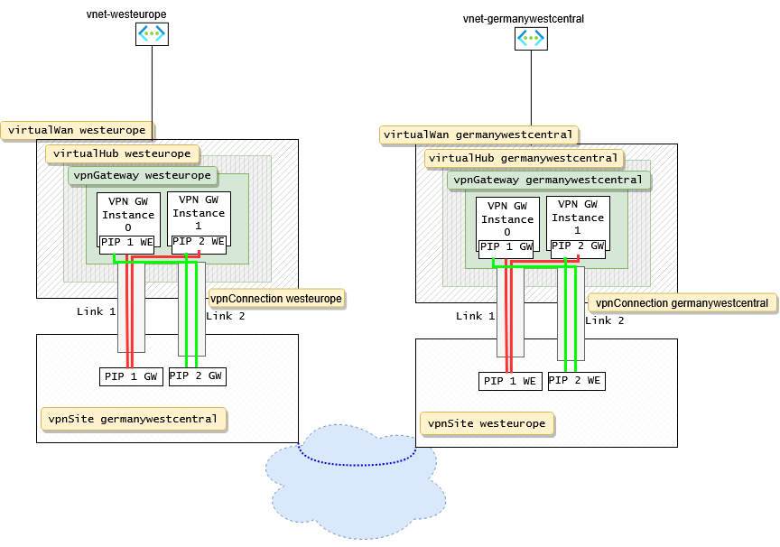
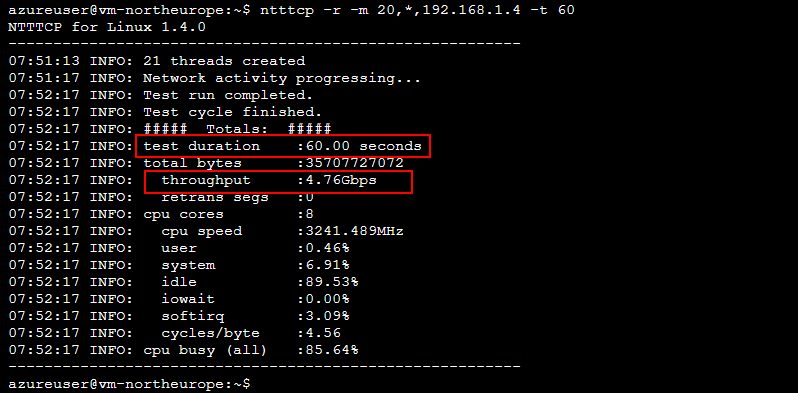
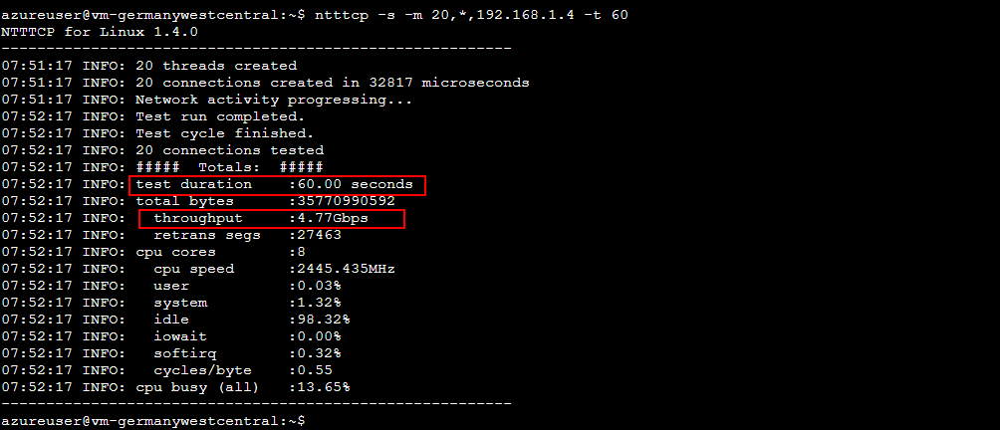

### Structure of this Article
- [Introduction](#introduction)
- [Concept: Link aggregation in Azure Virtual WAN](#concept-link-aggregation-in-azure-virtual-wan)
  - [Structure of the bicep deployment](#structure-of-the-bicep-deployment)
  - [Code \& Configuration](#code--configuration)
      - [Virtual Wan](#virtual-wan)
      - [Module for the VPN Gateway](#module-for-the-vpn-gateway)
      - [VNETs and VMs for the bandwidth test](#vnets-and-vms-for-the-bandwidth-test)
  - [Bandwidth Test in the Lab](#bandwidth-test-in-the-lab)
  - [Conclusion](#conclusion)


# Introduction 

Virtual WAN is a networking service that brings a lot of functionalities like  routing and  security together. It offers full managed mesh connectivity and various connectivity options.

Though anyone planning site-to-site VPN connections in Azure VWAN is probably aware of the ~1 GBit/s bandwidth limit per tunnel.

https://github.com/MicrosoftDocs/azure-docs/blob/main/includes/virtual-wan-limits.md

This article shows a way to bypass this limit by aggregating multiple tunnels (up to 8) to one interface in a Virtual WAN setup.

# Concept: Link aggregation in Azure Virtual WAN

Azure Virtual WAN site-to-site VPN can aggregate up to 4 links to transfer Data to a single site.
One Link consists of 2 VPN Tunnels. (Primary/Backup run in active/active mode)
When taken to the maximum you can have ~ >9 Gbit/s s2s VPN Gateway throughput to a single site.
A site can be anything from an on-premise site , or another azure virtual WAN.
<span style="font-size:10px;font-family:arial;">

| Links | Tunnels | achievable Bandwidth |
| :---- | :------ | :------------------- |
| 1     | 2       | ~ >2 Gbit/s          |
| 2     | 4       | ~ >4.5 GBit/s        |
| 3     | 6       | ~ >7 Gbit/s          |
| 4     | 8       | ~ >9 Gbit/s          |
</span>

This article is accompanied by a lab setup. The lab consists of two
Virtual WANs in two different Azure Regions which are interconnected via a 2 Link (4 Tunnel) s2s VPN:



In the lab setup the vpn tunnels are terminated on another Virtual WAN Hub.

It will work with any VPN termination device that is capable of aggergating multiple tunnels into one logic interface.

I successfully tested this setup with a Fortigate Firewall with 8 VPN Tunnels in one aggregation interface and a thoughput >> 8GBPs.
E.g. 
Fortigate.


## Structure of the bicep deployment 

[The diagram above](High-Level-Overview) shows the Azure resource elements of which the solution consists.

The virtualWan forms the outermost bracket around the other network components in a region.
The virtualWan contains the regional virtualHub in which we create a vpnGateway.
The vpnGateway by default has 2 Instances (0 and 1) with a publicIp each.

Also inside the virtualWan we create a vpnSite with 2 Links. 
The vpnSite describes  the VPN remote station to which we want to connect.

Each Link manages and establishes 2 Tunnels with the remote site.
The values for Vendor and Bandwidth are just for informative reasons (at least I didnt notice an effect).

The vpnSite is connected to the vpnGateway through a vpnConnection resource.

The vpnGateway is deployed through a module. so we can get the Public IPs of the two vpnGateway instances back from the module.

## Code & Configuration
#### Virtual Wan

The bicep code fro the is available in this repo here:

`main.bicep`
``` js

// deploy the vwans in both regions and the corresponding vhubs 

param region1 string = 'northeurope'
param region2 string = 'germanywestcentral'
param prefixRegion1 string = '10.10.0.0/16'
param prefixRegion2 string = '10.20.0.0/16'
param prefix2Region1 string = '192.168.1.0/24'
param prefix2Region2 string = '192.168.2.0/24'

resource vWanRegion1 'Microsoft.Network/virtualWans@2024-05-01' = {
  name: 'vwan-${region1}'
  location: region1
  properties: {
    allowBranchToBranchTraffic: true
    type: 'Standard'
  }
}
resource vhubRegion1 'Microsoft.Network/virtualHubs@2024-05-01' = {
    name: 'vhub-${region1}'
    location: region1
    properties: {
      addressPrefix: prefixRegion1
      routeTable: {
        routes: []
      }
      virtualRouterAutoScaleConfiguration: {
        minCapacity: 2
      }
      virtualWan: {
        id: vWanRegion1.id
      }
      hubRoutingPreference: 'ASPath'
    }
  }

resource vWanRegion2 'Microsoft.Network/virtualWans@2024-05-01' = {
  name: 'vwan-${region2}'
  location: region2
  properties: {
    allowBranchToBranchTraffic: true
    type: 'Standard'
  }
}

 

resource vhubRegion2 'Microsoft.Network/virtualHubs@2024-05-01' = {
  name: 'vhub-${region2}'
  location: region2
  properties: {
    addressPrefix: prefixRegion2
    routeTable: {
      routes: []
    }
    virtualRouterAutoScaleConfiguration: {
      minCapacity: 2
    }
    virtualWan: {
      id: vWanRegion2.id
    }
    hubRoutingPreference: 'ASPath'
  }
}

// the vpn gateways inside the hubs are called via module so we get the public IPs back
// the public ips  are needed to feed them into the vpnsite definitions

module vpnRegion1 'vpngw.bicep' = {
  name: 'vpngw-${region1}-${uniqueString(resourceGroup().id)}'
  params : {
  vpnGwName: 'vpngw-${region1}'
  vpnGwLoc: region1
   vHubId: vhubRegion1.id
   }
 }
module vpnRegion2 'vpngw.bicep' = {
 name: 'vpngw-${region2}-${uniqueString(resourceGroup().id)}'
 params : {
  vpnGwName: 'vpngw-${region2}'
  vpnGwLoc: region2
  vHubId: vhubRegion2.id
  }
}

// the vpnSite needs the ip address output of the vpnGateway module. Sometimes there seems to be a delay between the 
// provisioning of the vpnGw and the pip which lets the whole bicep script runs endlessly. 
// this is why there is the conditional.

resource vpnSiteRegion1 'Microsoft.Network/vpnSites@2023-05-01' = {
  name: 'vpnsite-${region1}'
  location: region1
  properties: {
    deviceProperties: {
      deviceVendor: 'Generic'
    }
    virtualWan: {
      id: vWanRegion2.id
    }
    addressSpace: {
      addressPrefixes: [
     prefixRegion1
     prefix2Region1
      ]
    }
    vpnSiteLinks: [
      {
        name: 'link-1'
        properties: {
          ipAddress: vpnRegion1.outputs.vpnGwPublicIps[0] == null ? '1.1.1.1' : vpnRegion1.outputs.vpnGwPublicIps[0]
        }
      }
      {
        name: 'link-2'
        properties: {
          ipAddress: vpnRegion1.outputs.vpnGwPublicIps[1] == null ? '2.2.2.2' : vpnRegion1.outputs.vpnGwPublicIps[1]
        }
      }
    ]
  }
}
resource vpnSiteRegion2 'Microsoft.Network/vpnSites@2023-05-01' = {
  name: 'vpnsite-${region2}'
  location: region2
  properties: {
    deviceProperties: {
      deviceVendor: 'Generic'
    }
    virtualWan: {
      id: vWanRegion1.id
    }
    addressSpace: {
      addressPrefixes: [
     prefixRegion2
     prefix2Region2
      ]
    }
    vpnSiteLinks: [
      {
        name: 'link-1'
        properties: {
          ipAddress: vpnRegion2.outputs.vpnGwPublicIps[0] == null ? '3.3.3.3' : vpnRegion2.outputs.vpnGwPublicIps[0]
        }
      }
      {
        name: 'link-2'
        properties: {
          ipAddress: vpnRegion2.outputs.vpnGwPublicIps[1] == null ? '4.4.4.4' :  vpnRegion2.outputs.vpnGwPublicIps[1]
        }
      }
    ]
  }
}

 

resource hubVpnConnectionRegion1 'Microsoft.Network/vpnGateways/vpnConnections@2020-05-01' = {
  name: 'vpngw-${region1}/HubToOnPremConnection'
  properties: {
    //enableBgp: false
    remoteVpnSite: {
      id: vpnSiteRegion2.id
    }
    vpnLinkConnections: [
      {
        name: 'link-1'
        properties: {
          vpnSiteLink: {
            id: resourceId('Microsoft.Network/vpnSites/vpnSiteLinks', 'vpnsite-${region2}', 'link-1')
          }
          //enableBgp: false
          sharedKey: 'test'
        }
      }
      {
        name: 'link-2'
        properties: {
          vpnSiteLink: {
            id: resourceId('Microsoft.Network/vpnSites/vpnSiteLinks', 'vpnsite-${region2}', 'link-2')
          }
          //enableBgp: false
          sharedKey: 'test'
        }
      }
    ]
  }
}

resource hubVpnConnectionRegion2 'Microsoft.Network/vpnGateways/vpnConnections@2020-05-01' = {
  name: 'vpngw-${region2}/HubToOnPremConnection'
  properties: {
    //enableBgp: false
    remoteVpnSite: {
      id: vpnSiteRegion1.id
    }
    vpnLinkConnections: [
      {
        name: 'link-1'
        properties: {
          vpnSiteLink: {
            id: resourceId('Microsoft.Network/vpnSites/vpnSiteLinks', 'vpnsite-${region1}', 'link-1')
          }
          //enableBgp: false
          sharedKey: 'test'
        }
      }
      {
        name: 'link-2'
        properties: {
          vpnSiteLink: {
            id: resourceId('Microsoft.Network/vpnSites/vpnSiteLinks', 'vpnsite-${region1}', 'link-2')
          }
          //enableBgp: false
          sharedKey: 'test'
        }
      }
    ]
  }
}
```
#### Module for the VPN Gateway
`vpngw.bicep`
``` js
//VPN Gateway Module
param vpnGwName string
param vpnGwLoc string
param vHubId string
resource vpngw 'Microsoft.Network/vpnGateways@2024-05-01' = {
  name: vpnGwName
  location: vpnGwLoc

  properties: {
    connections: []
    virtualHub: {
      id: vHubId
    }
    bgpSettings: {
      asn: 65515
      peerWeight: 0

    }
    vpnGatewayScaleUnit: 1
    
    natRules: []
    enableBgpRouteTranslationForNat: false
    isRoutingPreferenceInternet: false
  }
}
output vpnGwPublicIps array = [ 
  vpngw.properties.ipConfigurations[0].publicIpAddress
  vpngw.properties.ipConfigurations[1].publicIpAddress
]
```

#### VNETs and VMs for the bandwidth test

``` js
var imageReference = {
  'Ubuntu-2204': {
    publisher: 'Canonical'
    offer: '0001-com-ubuntu-server-jammy'
    sku: '22_04-lts-gen2'
    version: 'latest'
  }
}

resource nicregion1 'Microsoft.Network/networkInterfaces@2020-08-01' = {
  name: 'nic-vm-${region1}'
  location: region1
  properties:{
    enableIPForwarding: true
    ipConfigurations: [
      {
        name: 'ipv4config'
        properties:{
          primary: true
          privateIPAllocationMethod: 'Static'
          privateIPAddressVersion: 'IPv4'
          subnet: {
            id: vnetregion1.outputs.subnets[0].id
          }
          
          privateIPAddress: '192.168.1.4'         
        }
      }
    ]
  }
}
resource vmregion1 'Microsoft.Compute/virtualMachines@2020-12-01' = {
  name: 'vm-${region1}'
  location: region1
  zones: [ '1' ]
  properties: {
    hardwareProfile:{
      vmSize: vmSize
    }
    storageProfile: {
      osDisk: {
        createOption: 'FromImage'
        managedDisk: {
          storageAccountType: 'Standard_LRS'
        }
      }
      imageReference: imageReference['Ubuntu-2204']
    }
      osProfile:{
        computerName: 'vm-${primvHubName}'
        adminUsername: 'azureuser'
        adminPassword: adminPassword
        linuxConfiguration: {
          patchSettings: {
            patchMode: 'ImageDefault'
          }
        }
      }
      diagnosticsProfile: {
        bootDiagnostics: {
          enabled: true
   //       storageUri: bootstUri
        }
     }
      networkProfile: {
        networkInterfaces: [
        {
          id: nicregion1.id
        }
      ]
    }
  }
}

module vnetregion2'br:crdvagiacprd.azurecr.io/platform/bicep/virtualnetwork:0.8.2' = {
  name: 'vnet-vms-gwc-${uniqueString(resourceGroup().id)}'
  params: {
    applicationName: 'vm-'
    counter: 1
    location : secondaryRegion
    addressPrefixes: [ scndvmPrefix ]
    subnetsDefinitions: [
      {
        name: 'subnet1'
        subnetPrefix: scndvmPrefix
        delegations: []
        routeTable: []
        serviceEndpoints: []
        networkSecurityGroupName: []
        networkSecurityGroupResourceGroup: []
      }
    ]
  }
}
resource nicregion2 'Microsoft.Network/networkInterfaces@2020-08-01' = {
  name: 'vm-${region2}'
  location: region2
  properties:{
    enableIPForwarding: true
    ipConfigurations: [
      {
        name: 'ipv4config'
        properties:{
          primary: true
          privateIPAllocationMethod: 'Static'
          privateIPAddressVersion: 'IPv4'
          subnet: {
            id: vnetregion2.outputs.subnets[0].id
          }
          
          privateIPAddress: '192.168.2.4'         
        }
      }
    ]
  }
}
resource vmregion2 'Microsoft.Compute/virtualMachines@2020-12-01' = {
  name: 'vm-${region2}'
  location: region2
  zones: [ '1' ]
  properties: {
    hardwareProfile:{
      vmSize: vmSize
    }
    storageProfile: {
      osDisk: {
        createOption: 'FromImage'
        managedDisk: {
          storageAccountType: 'Standard_LRS'
        }
      }
      imageReference: imageReference['Ubuntu-2204']
    }
      osProfile:{
        computerName: 'vm-${region2}'
        adminUsername: 'azureuser'
        adminPassword: adminPassword
        linuxConfiguration: {
          patchSettings: {
            patchMode: 'ImageDefault'
          }
        }
      }
      diagnosticsProfile: {
        bootDiagnostics: {
          enabled: true
   //       storageUri: bootstUri
        }
     }
      networkProfile: {
        networkInterfaces: [
        {
          id: nicregion2.id
        }
      ]
    }
  }
}

resource VwanHubtovnet 'Microsoft.Network/virtualHubs/hubVirtualNetworkConnections@2020-05-01' = {
  parent: vHubRegion1
  name: 'VMvnet-region1-to-hub-comm'
  properties: {
    routingConfiguration: {
      associatedRouteTable: {
        id: resourceId('Microsoft.Network/virtualHubs/hubRouteTables', vHubRegion1.name, 'defaultRouteTable')
      }
      propagatedRouteTables: {
        labels: [
          'default'
        ]
        ids: [
          {
            id: resourceId('Microsoft.Network/virtualHubs/hubRouteTables', vHubRegion1.name, 'defaultRouteTable')
          }
        ]
      }
    }
    remoteVirtualNetwork: {
      id: vnetregion1.outputs.id

    enableInternetSecurity: false
  }
}
}
resource VwanHubtovnet2 'Microsoft.Network/virtualHubs/hubVirtualNetworkConnections@2020-05-01' = {
  parent: vHubRegion2
  name: 'VMvnet-region2-to-hub-comm'
  properties: {
    routingConfiguration: {
      associatedRouteTable: {
        id: resourceId('Microsoft.Network/virtualHubs/hubRouteTables', vHubRegion2.name, 'defaultRouteTable')
      }
      propagatedRouteTables: {
        labels: [
          'default'
        ]
        ids: [
          {
            id: resourceId('Microsoft.Network/virtualHubs/hubRouteTables', vHubRegion2.name, 'defaultRouteTable')
          }
        ]
      }
    }
    remoteVirtualNetwork: {
      id: vnetregion2.outputs.id

    enableInternetSecurity: false
  }
}
}
```

> [!NOTE]
>  From Azure side, as long as same address ranges are advertised from both the tunnels, the traffic distribution uses ECMP and each TCP or UDP flow will follow the same tunnel or path.

> [!Caution] > You must also configure ECMP (L3/4 Loadsharing)  for your on premises devices. This is important otherwise the connection will be useless.


## Bandwidth Test in the Lab

I test the throughput with the help of one Virtual Machine in each Region. As a testing tool I use the free NTTTCP by Microsoft. <a href="https://iperf.fr/iperf-download.php">iPerf3</a> is as well suitable for these bandwidth tests.

https://learn.microsoft.com/en-us/azure/virtual-network/virtual-network-bandwidth-testing?tabs=windows

To test throughput one VM is configured the reciever (vm-northeurope) and the other one as the sender (vm-germanywestcentral).

For demonstration purposes I limit the duration to 60 seconds to save costs. The VM Type shall be an V5 in order to be able to handle the load. 

> **_NOTE:_**   It is important that the VM size is sufficient to support the network traffic and load tool. Otherwise the bandwidth tests will not show the maximum throughput possible.

Install NTTTCP on both VMs:

``` SH

# For Ubuntu, install build-essential and git.

sudo apt-get update
sudo apt-get -y install build-essential
sudo apt-get -y install git

# Make and install NTTTCP-for-Linux.

git clone https://github.com/Microsoft/ntttcp-for-linux
cd ntttcp-for-linux/src
sudo make && sudo make install
```

Finally set one machine up as the sender and the other as the reciever

```
VM-Northeurope
ntttcp -r -m 20,*,192.168.1.4 -t 60
```
```
VM-Germanywestcentral
ntttcp -s -m 20,*,192.168.1.4 -t 60
```

The Screenshot of the results shows that there is around 4.7 GBps of bandwidth with parallel 20 streams.

**Northeurope**



**Germanywestcentral** 



## Conclusion

By combining multiple vWan vpnSite Links you can dynamically expand s2s bandwidth.

Take into Consideration that the load sharing is set to Equal Cost Multi Pathing on your on-prem device.

> [!Important] 
> Take into consideration that one TCP Stream will not be able to exceed ~ 1,25 GBps. Multiple Senders will be able to utilise the full bandwidth potential of your aggregated interface.


> 
> Take  into consideration that you will need an apropriate amount of public IP adresses on your remote site matching the amount of links you want to configure.

Also if you need that much bandwidth it might be feasible to opt for an Express Route. The provisioning of multiple VPN Links and scaling the VPN Gateways to meet the bw requirements can quickly reach high costs. Also the remote site needs to be provisioned hardware- & and admin expertise wise.

As a temporary solution for  mid bandwidth requirements this might be an apropriate solution though.